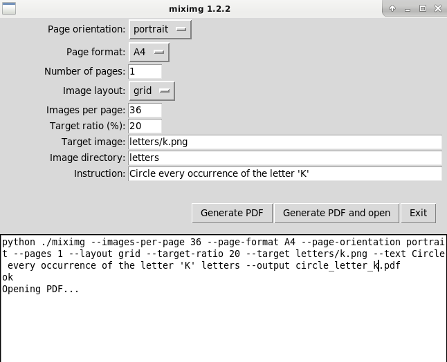
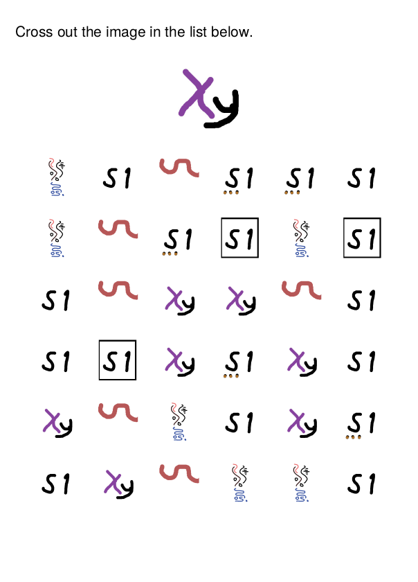

# Introduction

Miximg generates PDF documents with visual items, intended for printing and
having people play a game where a specific pattern must be searched.

Examples of such generated documents are provided in the directory 'samples'.

This software has two parts:

- miximg with a command line interface
- miximggui: a graphical user interface that uses the former

# Installation

Install the following before running miximg/miximggui:
- Python 3
- FPDF (Simple PDF generation for Python: pip install fpdf
- PIL (Python Imaging Library): pip install pillow

# Usage

Usage example (command line):

   miximg samples --text "Cross out the image in the list below." -o cross_out.pdf

# Screenshots

## Miximg GUI

## Example of generated PDF

